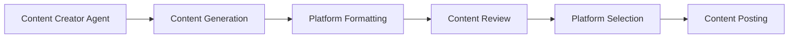
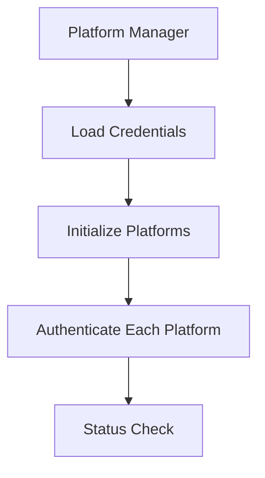

# Technical Documentation - Autonomous Social Media Curator

## Table of Contents
1. [System Architecture](#system-architecture)
2. [Core Components](#core-components)
3. [Data Flow](#data-flow)
4. [Integration Details](#integration-details)
5. [Error Handling](#error-handling)
6. [Configuration](#configuration)

## System Architecture

### Overview
The system uses a modular architecture with the following key components:

```
social_media_bot/
├── agents/          # AI agents using CrewAI
├── config/          # Configuration modules
├── database/        # Database management
├── platforms/       # Platform implementations
└── tools/          # Utility tools
```

### Core Technologies
- **CrewAI**: Agent orchestration framework
- **Deepseek LLM**: Content generation and analysis
- **SQLAlchemy**: Database ORM
- **Platform APIs**: Dev.to and Mastodon integration

## Core Components

### 1. Platform Management
```python
class PlatformManager:
    """
    Manages platform initialization, authentication, and posting
    Location: social_media_bot/platforms/manager.py
    """
    def __init__(self):
        self.platforms: Dict[Platform, SocialMediaPlatform] = {}
        self._initialize_platforms()
```

Key Features:
- Dynamic platform initialization
- Centralized authentication management
- Unified posting interface
- Platform status monitoring

### 2. Content Tools
```python
class ContentTools(BaseTool):
    """
    Handles content generation and posting
    Location: social_media_bot/tools/content_tools.py
    """
    _platform_manager: PlatformManager = PrivateAttr()
```

Responsibilities:
- Content generation
- Platform-specific formatting
- Posting coordination
- Result tracking

### 3. Platform Implementations

#### Dev.to Platform
```python
class DevTo(SocialMediaPlatform):
    """
    Dev.to specific implementation
    Location: social_media_bot/platforms/devto.py
    """
```
Features:
- API authentication
- Article posting with tags
- Status monitoring
- Error handling

#### Mastodon Platform
```python
class Mastodon(SocialMediaPlatform):
    """
    Mastodon specific implementation
    Location: social_media_bot/platforms/mastodon.py
    """
```
Features:
- OAuth authentication
- Status posting
- Media handling
- Visibility controls

### 4. Database Integration
```python
class DatabaseManager:
    """
    Database operations management
    Location: social_media_bot/database/db_manager.py
    """
```
Features:
- PostgreSQL integration
- Schema management
- Transaction handling
- Performance optimization

## Data Flow

### 1. Content Creation Flow


### 2. Platform Authentication Flow


## Integration Details

### 1. Platform Integration

#### Dev.to API Integration
```python
def post_content(self, content: str, **kwargs) -> Dict[str, Any]:
    """
    Posts content to Dev.to
    Required kwargs:
    - title: str
    - tags: List[str]
    """
```

#### Mastodon API Integration
```python
def post_content(self, content: str, **kwargs) -> Dict[str, Any]:
    """
    Posts content to Mastodon
    Optional kwargs:
    - visibility: str
    - media_ids: List[str]
    """
```

### 2. Database Schema
```sql
-- Post History Table
CREATE TABLE post_history (
    id SERIAL PRIMARY KEY,
    platform VARCHAR NOT NULL,
    content TEXT NOT NULL,
    posted_at TIMESTAMP,
    status VARCHAR,
    performance_metrics JSONB
);
```

## Error Handling

### 1. Platform-Level Error Handling
```python
try:
    result = platform.post_content(content, **kwargs)
except PlatformError as e:
    logger.error(f"Platform error: {str(e)}")
    return {"success": False, "error": str(e)}
```

### 2. Retry Mechanism
```python
def _post_with_retry(self, platform: Platform, content: str, **kwargs):
    for attempt in range(self.max_retries):
        try:
            result = self.platform_manager.post_to_platform(
                platform=platform,
                content=content,
                **kwargs
            )
            if result.get("success"):
                return result
        except Exception as e:
            logger.error(f"Attempt {attempt + 1} failed: {str(e)}")
            time.sleep(2 ** attempt)  # Exponential backoff
```

## Configuration

### 1. Environment Variables
```python
# Required environment variables
DEEPSEEK_API_KEY=str
DEVTO_API_KEY=str
DEVTO_USERNAME=str
MASTODON_ACCESS_TOKEN=str
MASTODON_SERVER=str
DATABASE_URL=str
```

### 2. Platform Configuration
```python
class PlatformConfig:
    @staticmethod
    def get_enabled_platforms():
        """Returns list of platforms with valid credentials"""
```

## Security Considerations

1. **API Key Management**
   - Keys stored in environment variables
   - No hardcoded credentials
   - Secure credential validation

2. **Rate Limiting**
   - Platform-specific rate limits
   - Exponential backoff
   - Request tracking

3. **Error Prevention**
   - Input validation
   - Content safety checks
   - Platform status verification

## Testing

### 1. Database Testing
```python
def test_database_persistence():
    """
    Tests database operations and persistence
    Location: social_media_bot/database/test_db.py
    """
```

### 2. Platform Testing
```python
def test_platform_authentication():
    """
    Tests platform authentication and posting
    Location: tests/test_platforms.py
    """
```

## Deployment

### 1. Requirements
- Python 3.8+
- PostgreSQL database
- Platform API credentials
- Deepseek API access

### 2. Setup Process
1. Database initialization
2. Environment configuration
3. Platform authentication
4. System startup

## Monitoring and Logging

### 1. Logging System
```python
logging.basicConfig(level=logging.INFO)
logger = logging.getLogger(__name__)
```

### 2. Performance Tracking
- Post success rates
- Platform response times
- Error frequency
- Content engagement

## Future Enhancements

1. **Additional Platforms**
   - Twitter/X integration
   - LinkedIn support
   - Instagram capability

2. **Enhanced Analytics**
   - Engagement tracking
   - Performance metrics
   - Content optimization

3. **Advanced Features**
   - Media handling
   - Scheduled posting
   - Content templates 